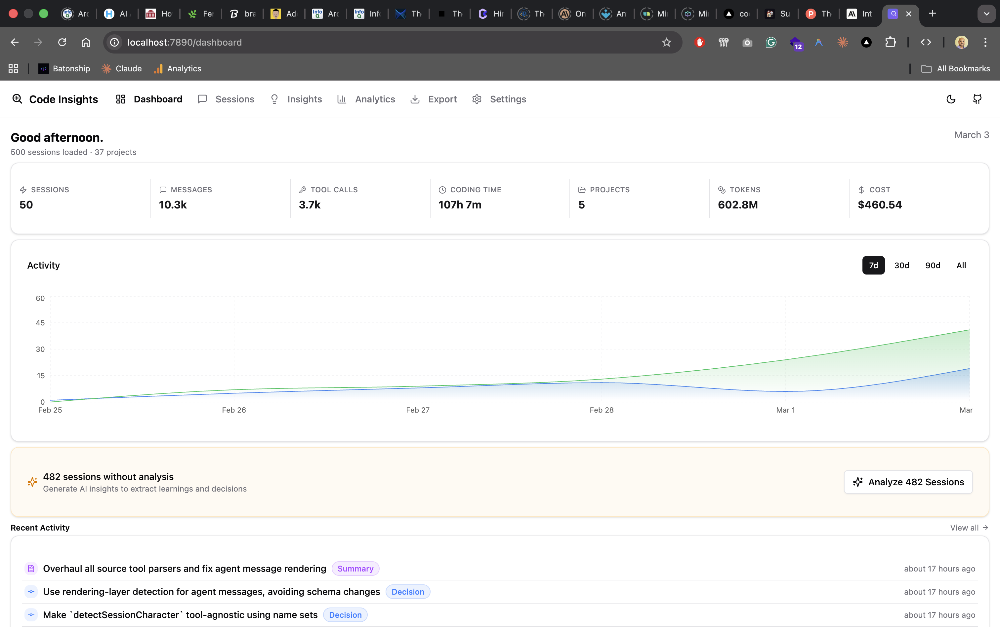
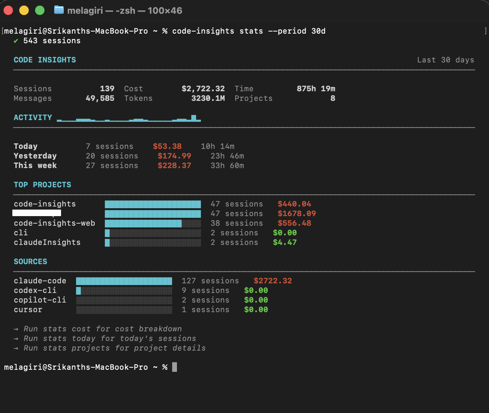

<p align="center">
  
</p>

<h1 align="center">Code Insights</h1>

<p align="center">
  <a href="https://www.npmjs.com/package/@code-insights/cli"></a>
  <a href="https://www.npmjs.com/package/@code-insights/cli"></a>
  <a href="https://github.com/melagiri/code-insights/blob/master/LICENSE"></a>
  <a href="https://nodejs.org"></a>
  <a href="https://socket.dev/npm/package/@code-insights/cli"></a>
</p>

Turn your AI coding sessions into knowledge.

Parses session history from Claude Code, Cursor, Codex CLI, Copilot CLI, and VS Code Copilot Chat. Stores structured data in a local SQLite database. Surfaces insights through terminal analytics and a built-in browser dashboard — with cross-session pattern detection and LLM-powered synthesis.

**No accounts. No cloud. No data leaves your machine.**

<p align="center">
  
</p>

## Quick Start

```bash
# Try instantly (no install needed)
npx @code-insights/cli

# Or install globally
npm install -g @code-insights/cli
code-insights                          # sync sessions + open dashboard
```

### Individual commands

```bash
code-insights stats                    # terminal analytics (no dashboard needed)
code-insights stats today              # today's sessions

code-insights dashboard                # start dashboard server (auto-syncs first)
code-insights dashboard --no-sync      # start dashboard without syncing
code-insights sync                     # sync sessions only
code-insights init                     # customize settings (optional)
```

## What It Does

- **Multi-tool support** — parses sessions from Claude Code, Cursor, Codex CLI, Copilot CLI, and VS Code Copilot Chat
- **Terminal analytics** — `code-insights stats` shows cost, usage, and activity breakdowns
- **Built-in dashboard** — browser UI for session browsing, analytics, insights, patterns, and export
- **Reflect & Patterns** — cross-session pattern detection with weekly synthesis: friction points (with attribution), effective patterns (with driver classification), prompt quality analysis, and working style rules
- **LLM analysis** — generates summaries, decisions, learnings, prompt quality (7 deficit + 3 strength categories), and session facets for pattern aggregation
- **Export** — LLM-powered cross-session synthesis in 4 formats: Agent Rules, Knowledge Brief, Obsidian, and Notion
- **Cost tracking** — per-session LLM analysis cost with provider, model, and token breakdown
- **Session character** — each session is classified into one of 7 types (deep_focus, bug_hunt, feature_build, exploration, refactor, learning, quick_task)
- **Auto-sync hook** — `install-hook` keeps your database up to date automatically
- **PR link detection** — GitHub PR links referenced in sessions are automatically extracted and displayed

## Supported AI Tools

| Tool | Data Location |
|------|---------------|
| Claude Code | `~/.claude/projects/**/*.jsonl` |
| Cursor | Workspace storage SQLite (macOS, Linux, Windows) |
| Codex CLI | `~/.codex/sessions/YYYY/MM/DD/rollout-*.jsonl` |
| Copilot CLI | `~/.copilot/session-state/{id}/events.jsonl` |
| VS Code Copilot Chat | Platform-specific Copilot Chat storage |

## CLI Reference

```bash
code-insights                          # sync + open dashboard (zero-config)
code-insights init                     # customize settings (optional)
code-insights sync                     # Sync sessions to local database
code-insights sync --force             # Re-sync all sessions
code-insights sync --source cursor     # Sync only from a specific tool
code-insights sync --dry-run           # Preview without making changes
code-insights sync prune               # Soft-delete sessions with preview
code-insights status                   # Show sync statistics
code-insights dashboard                # Start dashboard server and open browser
code-insights dashboard --no-sync      # Start dashboard without syncing
code-insights dashboard --port 8080    # Custom port (default: 7890)
code-insights stats                    # Terminal overview (last 7 days)
code-insights stats cost               # Cost breakdown by project and model
code-insights stats projects           # Per-project detail cards
code-insights stats today              # Today's sessions
code-insights stats models             # Model usage distribution
code-insights stats patterns           # Cross-session patterns summary
code-insights reflect                  # Cross-session LLM synthesis
code-insights reflect --week 2026-W11  # Reflect on a specific ISO week
code-insights reflect backfill         # Backfill facets for legacy sessions
code-insights config                   # Show configuration
code-insights config llm               # Configure LLM provider (interactive)
code-insights install-hook             # Auto-sync when Claude Code sessions end
code-insights reset --confirm          # Delete all local data
```

<p align="center">
  
</p>

## Architecture

```
Session files (Claude Code, Cursor, Codex CLI, Copilot CLI, VS Code Copilot Chat)
                          │
                          ▼
               ┌──────────────────┐
               │   CLI Providers  │  discover + parse sessions
               └──────────────────┘
                          │
                          ▼
               ┌──────────────────┐
               │  SQLite Database │  ~/.code-insights/data.db
               └──────────────────┘
                    │          │
          ┌─────────┘          └──────────┐
          ▼                               ▼
  ┌───────────────┐            ┌──────────────────┐
  │  stats/reflect │            │  Hono API server │
  │  (terminal)    │            │  + React SPA     │
  └───────────────┘            │  localhost:7890   │
                               └──────────────────┘
                                        │
                                        ▼
                               ┌──────────────────┐
                               │  LLM Providers   │  analysis, facets,
                               │  (your API key)  │  reflect, export
                               └──────────────────┘
```

The monorepo contains three packages:
- **`cli/`** — Node.js CLI, session providers, SQLite writes, terminal analytics
- **`server/`** — Hono API server, REST endpoints, LLM proxy (API keys stay server-side)
- **`dashboard/`** — Vite + React SPA, served by the Hono server

## Development

```bash
git clone https://github.com/melagiri/code-insights.git
cd code-insights
pnpm install
pnpm build
cd cli && npm link
code-insights --version
```

See [`cli/README.md`](cli/README.md) for the full CLI reference, and [`CONTRIBUTING.md`](CONTRIBUTING.md) for contribution guidelines.

## Privacy

Session data stays on your machine in `~/.code-insights/data.db`. No accounts, no cloud sync. Anonymous usage telemetry is opt-out (`code-insights telemetry disable`). LLM analysis uses your own API key (or Ollama locally) — session content goes only to the provider you configure.

## License

MIT — see [LICENSE](LICENSE) for details.
